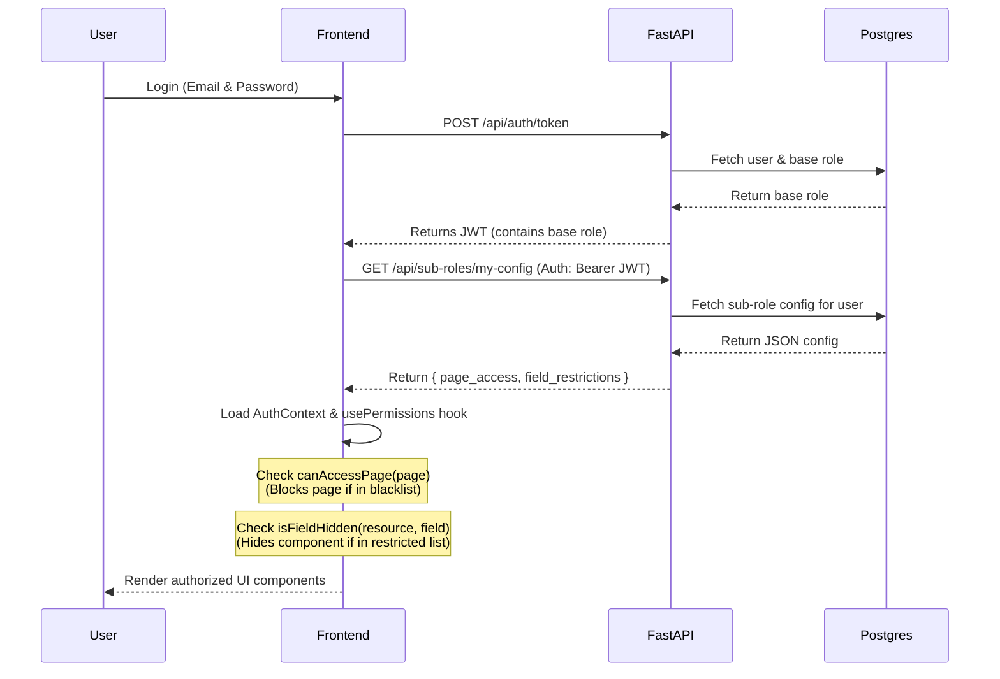

# Role-Based Access Control (RBAC) & Sub-Roles — Utiliza AI

## Overview

Utiliza AI uses a custom RBAC system built on top of its existing JWT authentication. The implementation adds **four base roles** with a strict hierarchy, and an additional layer of **sub-roles** for fine-grained UI restrictions.

The system is enforced at three layers:
1. **Database** — roles, sub-roles, and permissions stored in PostgreSQL.
2. **Backend API** — FastAPI route guards using `Depends()`.
3. **Frontend UI** — React context, hooks, and conditional rendering to hide pages and fields.

No third-party RBAC libraries are used. The entire system is lightweight and fully custom.

---

## Access Control Architecture

The access control process operates in two distinct phases: determining base permissions, then applying restrictive sub-role UI configurations.

```mermaid
flowchart TD
    User([User Login]) --> JWT[JWT Token Issued\n(Base Role embedded)]
    JWT --> FetchConfig[Fetch UI Config\nGET /api/sub-roles/my-config]
    
    FetchConfig --> BaseRole{1. Base Role Evaluation\n(Additive Permissions)}
    
    BaseRole --> |master_admin| AdminPerms[Full CRUD + Admin Ops]
    BaseRole --> |editor| EditorPerms[Standard CRUD Ops]
    BaseRole --> |viewer| ViewerPerms[Read-Only + Financials]
    BaseRole --> |restricted_viewer| RestrictedPerms[Read-Only Limited]

    AdminPerms --> SubRoleCheck
    EditorPerms --> SubRoleCheck
    ViewerPerms --> SubRoleCheck
    RestrictedPerms --> SubRoleCheck

    SubRoleCheck{2. Sub-Role Evaluation\n(Restrictive UI Rules)}
    
    SubRoleCheck --> PageBlock[Page Blacklist\ne.g., Hide 'Dashboard']
    SubRoleCheck --> FieldBlock[Field Restrictions\ne.g., Hide 'Budget' or 'Phone']
    
    PageBlock --> UI[Render Permitted UI]
    FieldBlock --> UI
```

---

## 1. Base Roles (Additive Permissions)

Base roles determine fundamental access rights to API endpoints and broad functional areas in the frontend.

```
restricted_viewer (0) < viewer (1) < editor (2) < master_admin (3)
```

| Role | Level | Description |
|---|---|---|
| `restricted_viewer` | 0 | Read-only. Employee PII and project financials are hidden. No Settings page. |
| `viewer` | 1 | Full read-only including financials. Settings visible, no write actions. |
| `editor` | 2 | Full CRUD on employees, projects, allocations, clients. Cannot edit financials or manage users. |
| `master_admin` | 3 | Unrestricted. User management, bulk ops, financial field edits. |

---

## 2. Sub-Roles (Restrictive Fine-Grained UI Control)

Sub-roles are custom configurations created by a `master_admin` that further restrict which pages and data fields are visible in the UI. 
**Sub-roles can only RESTRICT access; they never expand it.** 

### Core Features
- **Page Access (Blacklist Logic)**: Explicitly defines which pages the user **CANNOT** see. If a page is in the `page_access` array, access is blocked.
- **Field Restrictions**: Hides specific data fields (e.g., `phone`, `budget`) in the UI, even if the user's base role technically allows them to view the page.

### Database Schema
**File:** `database/migrate_sub_roles.sql`

```sql
CREATE TABLE public.sub_roles (
    sub_role_id        SERIAL PRIMARY KEY,
    name               VARCHAR(100) NOT NULL UNIQUE,
    label              VARCHAR(150) NOT NULL,
    description        TEXT,
    base_role          VARCHAR(50) NOT NULL REFERENCES public.roles(role_name),
    page_access        TEXT[] NOT NULL DEFAULT '{}',
    field_restrictions JSONB  NOT NULL DEFAULT '{}',
    created_at         TIMESTAMP DEFAULT CURRENT_TIMESTAMP,
    updated_at         TIMESTAMP DEFAULT CURRENT_TIMESTAMP
);

ALTER TABLE public.users ADD COLUMN sub_role_id INTEGER REFERENCES public.sub_roles(sub_role_id);
```

---

## Data Flow Summary



---

## Layer 1 — Database Layer

**File:** `database/migrate_rbac.sql`

Role and permission mappings are stored in PostgreSQL using `roles`, `permissions`, and a `role_permissions` join table. 
All users are assigned a `role_id` and optionally a `sub_role_id`.

### Seeded Base Permissions

| Resource | Actions |
|---|---|
| `employees` | read, write, delete |
| `employee_pii` | read *(phone, date_of_birth, address)* |
| `projects` | read, write, delete |
| `project_commercials` | read, write *(budget, billing_type, revenue_model, contract_type, commercial_notes)* |
| `allocations` | read, write, delete |
| `clients` | read, write |
| `dashboard` | read |
| `settings_admin` | read, write *(import, sync, export)* |
| `users` | read, write *(role assignment, deactivation)* |

---

## Layer 2 — Backend Enforcement (FastAPI)

### 2a. Role embedded in JWT
**File:** `backend/app/auth_utils.py`
The base role is embedded directly in the JWT during login, avoiding extra DB lookups for base permission checks on every request.

### 2b. API Route Guards
**File:** `backend/app/rbac_utils.py`

Guards protect routes using FastAPI's `Depends()`:
- `require_role("master_admin")`: Exact match checks.
- `require_min_role("editor")`: Hierarchical checks (allows editor and master_admin).

```python
@router.post("", dependencies=[Depends(require_min_role("editor"))])
def create_employee(...):
    ...
```

### 2c. Backend Field Stripping
Before returning data, sensitive information is stripped from the JSON response based on the `FIELD_RESTRICTIONS` matrix for the `restricted_viewer` and `viewer` roles.

```python
results.append(strip_fields(d, role, "employee")) # Strips phone/dob for restricted
```

---

## Layer 3 — Frontend Enforcement (React)

### 3a. usePermissions Hook
**File:** `frontend/src/hooks/usePermissions.js`

This custom hook merges the base role (from the JWT) and the sub-role config (from `/api/sub-roles/my-config`) to drive conditional UI rendering.

```javascript
export function usePermissions() {
    const { role, subRoleConfig } = useAuth();
    
    // ... hierarchy logic ...

    function canAccessPage(page) {
        // BLACKLIST Logic: If page is in the array, access is blocked.
        const restricted = subRoleConfig?.page_access ?? [];
        if (restricted.length === 0) return true;
        return !restricted.includes(page); 
    }

    function isFieldHidden(resource, field) {
        // Checks base restrictions AND sub-role restrictions
        const base = BASE_FIELD_RESTRICTIONS[effectiveRole]?.[resource] ?? [];
        if (base.includes(field)) return true;
        
        const sub = subRoleConfig?.field_restrictions?.[resource] ?? [];
        return sub.includes(field);
    }

    return { role, can, isAtLeast, canAccessPage, isFieldHidden };
}
```

### 3b. UI Components Implementation
UI components import the hook and wrap elements:

**Page Level:**
The `Navbar.jsx` dynamically filters menu options:
```javascript
const menuItems = allMenuItems.filter(item => 
    isAtLeast(item.minRole) && canAccessPage(item.path)
);
```

**Field Level:**
`EmployeeDetails.jsx` and `ProjectDetailsPage.jsx` wrap sensitive UI elements:
```javascript
{!isFieldHidden('project_detail', 'budget') && (
    <div>
        <p>Project Budget</p>
        <p>{project.budget}</p>
    </div>
)}
```

---

## File Index

| File | Layer | Purpose |
|---|---|---|
| `database/migrate_rbac.sql` | DB | Creates roles, permissions, role_permissions; seeds data |
| `database/migrate_sub_roles.sql` | DB | Creates sub_roles table and users.sub_role_id |
| `backend/app/rbac_utils.py` | API | `require_role()`, `require_min_role()`, `strip_fields()` |
| `backend/app/routers/sub_roles.py` | API | Sub-role management CRUD and user config retrieval |
| `frontend/src/context/AuthContext.jsx` | UI | Decodes JWT, fetches `subRoleConfig` and manages global state |
| `frontend/src/hooks/usePermissions.js` | UI | Evaluates base rules and sub-role UI blocks `isFieldHidden()` |
| `frontend/src/dashboard/Settings.jsx` | UI | UI for administrators to assign and create sub-roles |
